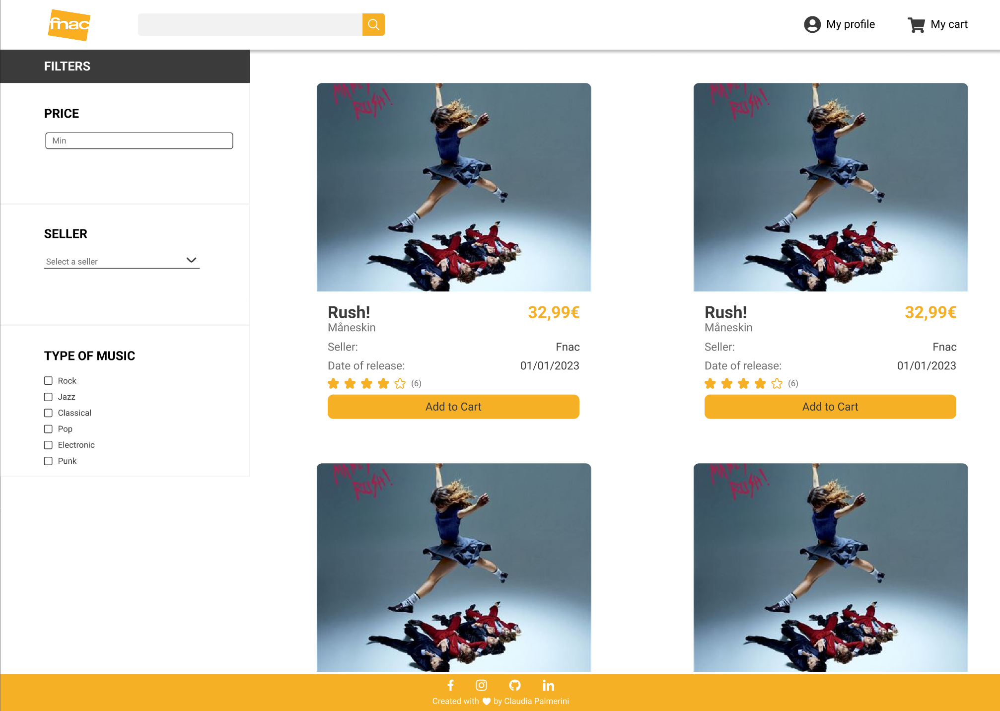
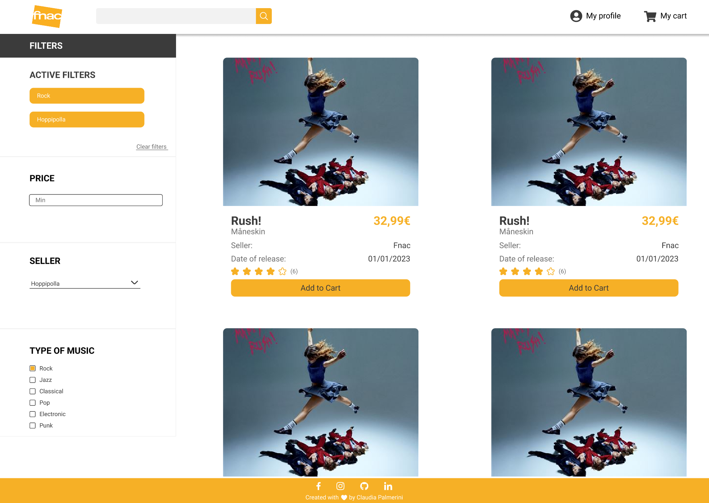
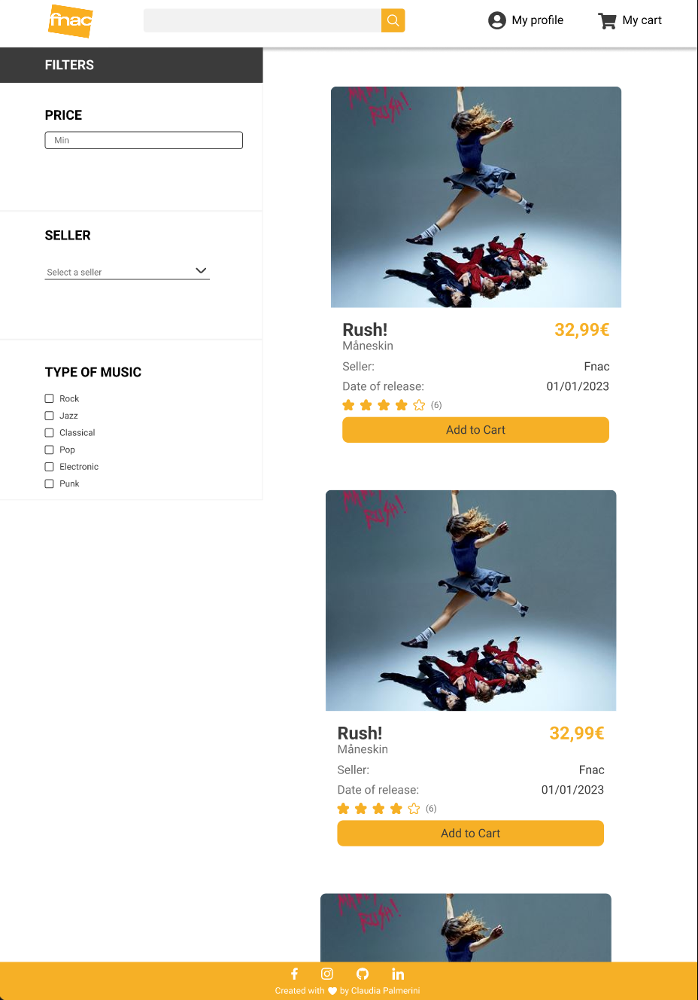
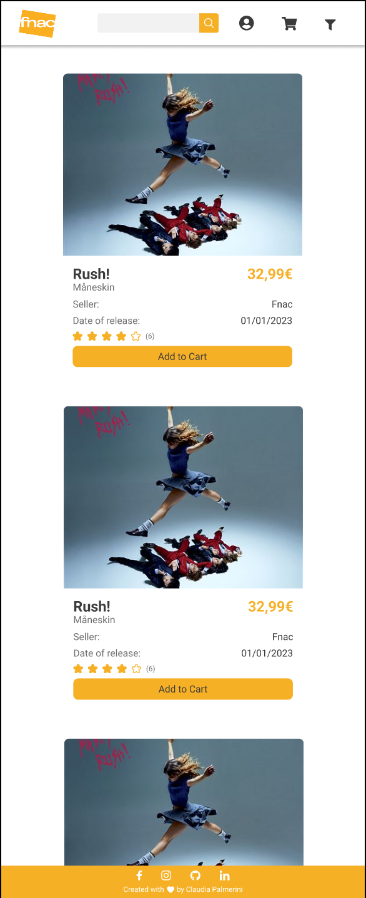
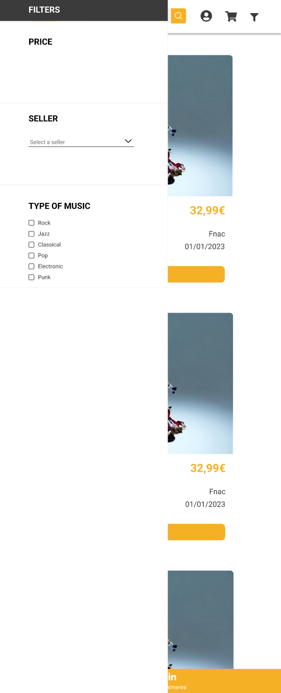

# Project 2 - HTML & CSS & js

## Acceptance criteria

### JS:

- [x] The HTML of the web page is dynamically generated using templates that are defined in JavaScript. You are allowed to have two base sections: ".filter" and ".products" to insert elements using JavaScript for the DOM.
- [x] The list of products will be looped through, and a product card will be dynamically created for each element using either a "for" loop or ".forEach".
- [x] At least two filters will be defined for the products on the left side of the document: the first filter will be a select element that displays all the different sellers in the project's products. When clicked, it will only display the elements that have the same seller value. For this, at least 4 different sellers will be defined in the products' "seller" property. The second filter will be a number input accompanied by a button with the text "Search". The user will be able to enter a price amount in the filter and click "Search", which will display only the elements whose price is lower than this amount.
- [x] There will be a "Clear Filters" button that, when clicked, will display all the products on the screen again without applying any filters.

### HTML & CSS

- [x] The HTML code is correctly structured. There are two main sections or articles representing the search filters (on the left side for desktop, above the content for mobile) and the items for sale in the store (on the right side for desktop, below the filters for mobile).
- [x] The items for sale in the store share the same CSS class, which defines a product card and has some hover effects when the mouse is over them.
- [x] The website has media queries for desktop and mobile, as well as a correct structure and positioning of elements using flex or grid.
- [x] The products have correct images that are displayed in the component card for each one.

## Implementation:

- The project is a basic copy of the Fnac web site. It is done with HTML, CSS and JS
- I use the desktop first approach
- I use holy grail `grid` layout for the main structure: with an header, aside with filter section, main content and footer
- The web site is fully responsive
- For the mobile, the aside is hidden and there is a filter button on the top right to show the filter section from the left side
- The project has the functionality of multiple filters, by price, by seller and by type of music
- There is a clear filter button to clear all the filters that were applied
- I add a section called "active filter" to show the applied filter and the number of the products available with these filters
- I add some animation when hovering on the links in the navbar and the image when hovering on one of the cards
- I use the following breakpoints
  - Desktop: 1440px
  - Tablet: 950px
  - Mobile: 750px

## Figma design:

### Desktop:

With active filter section

### Tablet

### Mobile

With filter section

